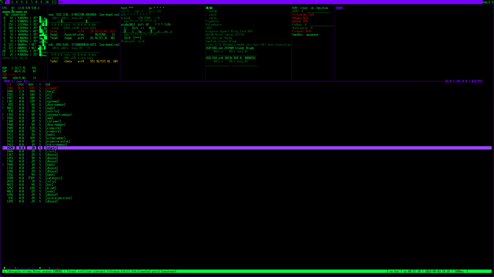

# bsc

TUI system monitor. Go, no deps, static binary. Requires root.

```
bash scripts/bsc-cmd build go
bash scripts/bsc-cmd install go -y
bsc        # auto re-execs via sudo if not root
```

---



---

**OVW** — CPU per-core (freq/temp/turbo/throttle/RAPL) · RAM/swap/zram · GPU (nvidia/amd/intel) · disk (MB/s, IOPS, latency, SMART) · net (rx/tx, IP, wifi SSID/signal) · VMs/containers · audio servers · hooks · process list with space-mark + batch kill

**DEV** — memory map · scheduler · kernel tunables · CPU flags · IRQs · kernel log · thread syscall trace per-TID

**SEC** — kernel hardening · taint · rootkit indicators · hardware security (IOMMU/microcode) · firewall · group security · entropy · timesync · firewall rules · AppArmor/SELinux · network vulns · listening ports · users · cpu vulnerabilities

**HEX** — process memory · raw block device · packet capture (AF_PACKET) · VRAM BAR1 dump

**ASM** — live disassembly via objdump, per-process, function navigation

---

`a` = anonymous mode (hides IPs/MACs/users for screenshots)
